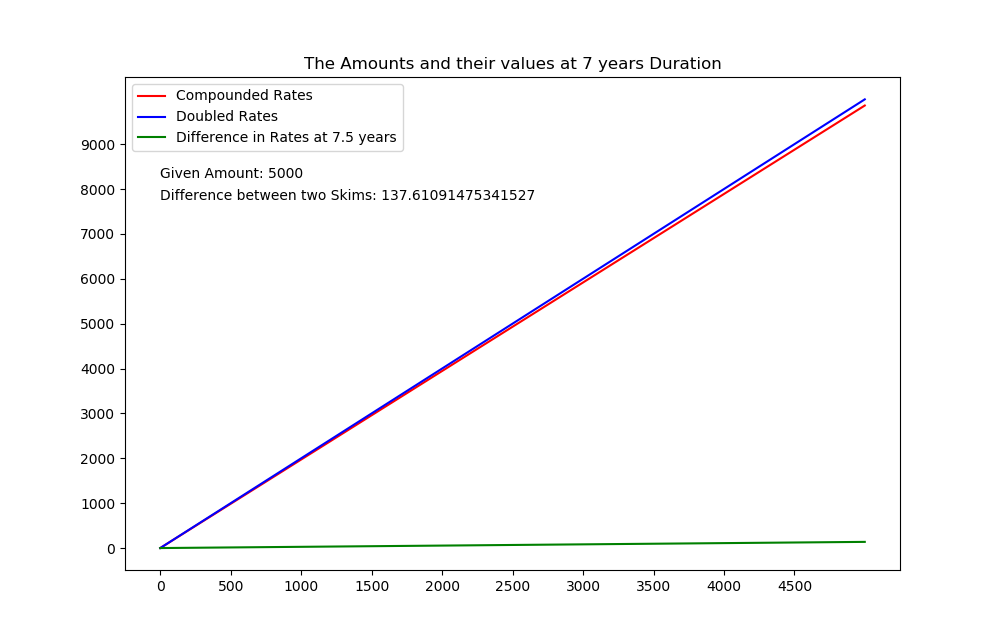
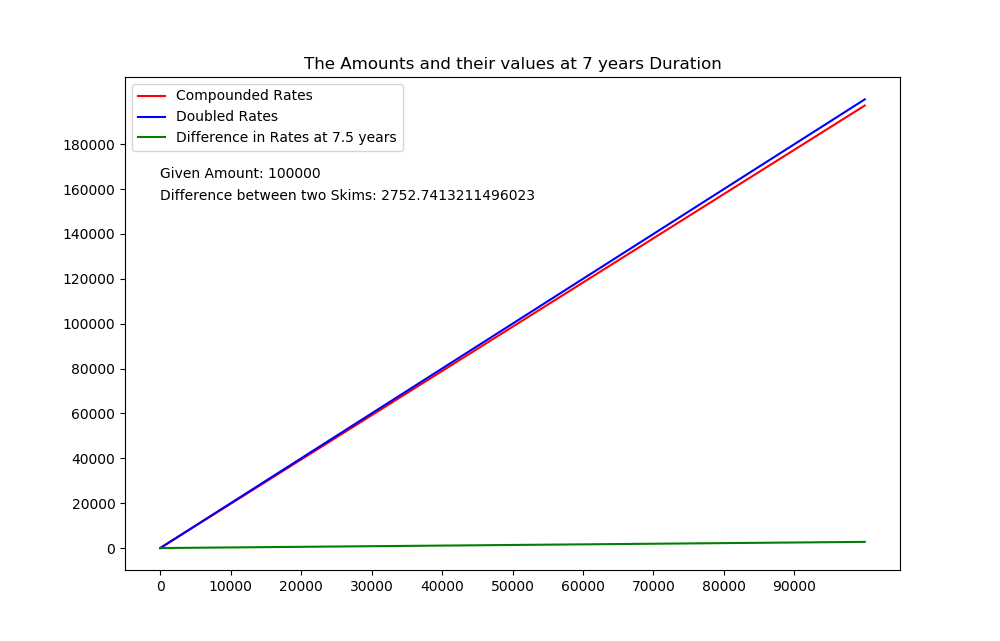
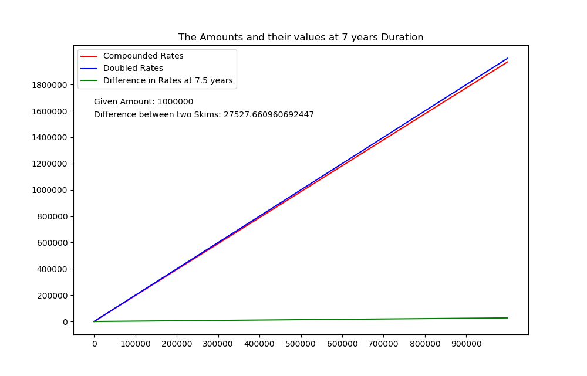
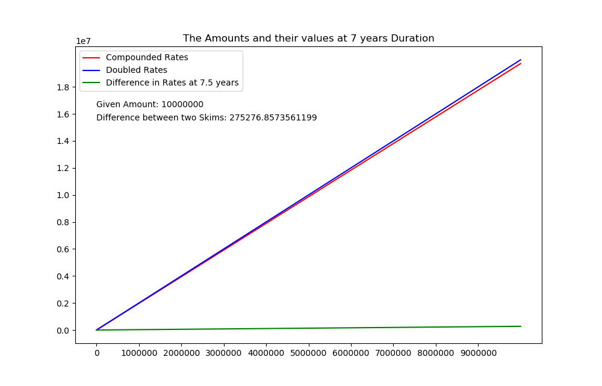

# NIBL-MoneyDouble

NIBL has recently launched its money double plan in 7.5 years duration.<b>Should you invest your money on this plan ?</b>

So, I perfomed some visualizations to check if it is a good thing or not.

<h3>Following things are visualized</h3>
  <li>Amount of Sum and there differences from the compounded interest p.a.</li>
  <li>Continuous Distribution up to the given amount</li>

<h3>5 Thousand</h3>
	
<h3>10 Thousand</h3>
	
<h3>1 Lakh</h3>
	
<h3>10 Lakh</h3>
	
<h3>1 Crore</h3>
	
<h2>My Conclusion</h2>

Well, if you have a lot of money, you can invest on this plan. But, I do not think it makes any difference.

